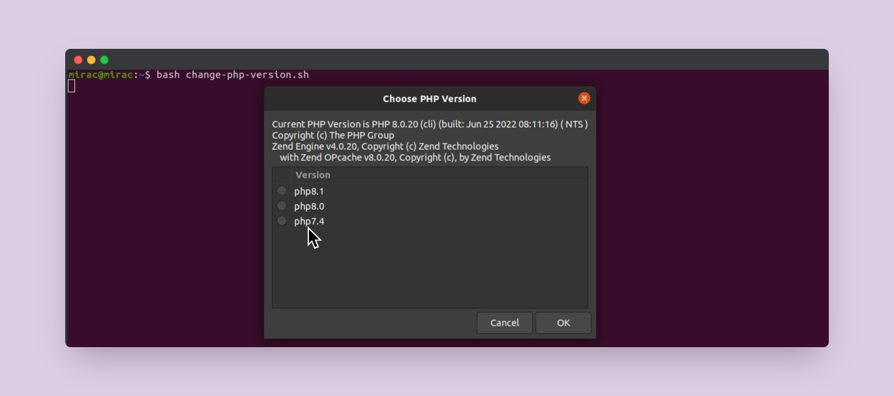

<h1 align="center">Welcome to Change PHP version in UI Modal 👋</h1>
<p>
  <a href="https://twitter.com/miracsengonul" target="_blank">
    
  </a>
</p>

> You can quickly change your PHP version.




## Install 🐧

```sh
sudo apt-get install zenity
```

```sh
git clone https://github.com/miracsengonul/change-php-version.git
```

## Usage

```sh
cd change-php-version
```

```sh
bash change-php-version.sh
```

## Author

👤 **mirac sengonul**

* Twitter: [@miracsengonul](https://twitter.com/miracsengonul)
* Github: [@miracsengonul](https://github.com/miracsengonul)
* LinkedIn: [@miracsengonul](https://linkedin.com/in/miracsengonul)

## Show your support

Give a ⭐️ if this project helped you!

***
